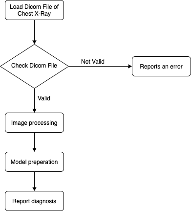
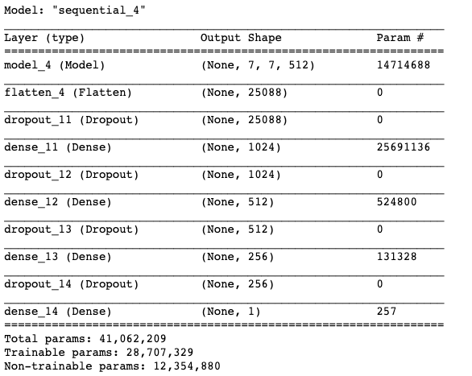
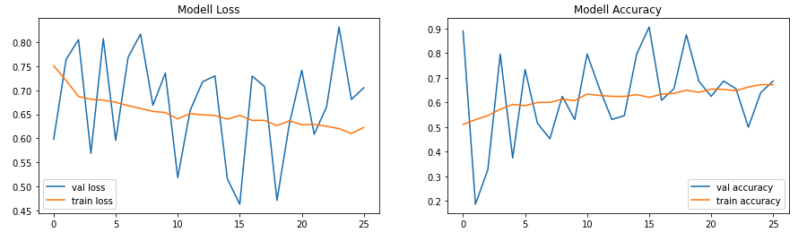
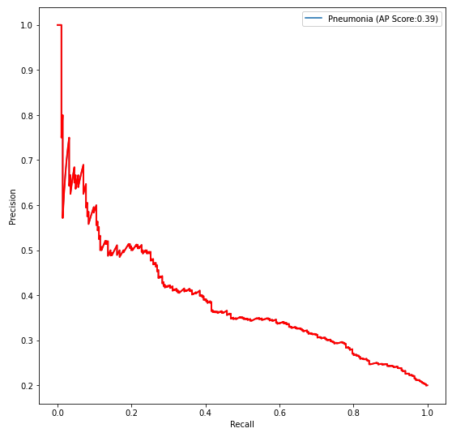

# FDA  Submission

**Your Name:**
Sascha Metzger

**Name of your Device:**
Chest X-Rays Pneumonia Detector

## Algorithm Description

### 1. General Information

**Intended Use Statement:**
Help Radiologists in detecting Pneumonia in Chest X-Rays

**Indications for Use:**
- Applicable for men and women from 1 to 90 years old
- Chest X-Ray image must be taken in the AP or PA position
- Chest X-Ray image must be in DICOM format

**Device Limitations:**
- Diagnosis can be made on a computer with a standard CPU, although a GPU is preferred

**Clinical Impact of Performance:**
- The model has a lower precision and higher recall
- This means the model is most confident when the test result is negative
- Therefore it is best used for worklist prioritization and not as a diagnosis tool

### 2. Algorithm Design and Function

**DICOM Checking Steps:**
- Modality is "DX"
- Body part examined is "CHEST"
- Patient Position is "PA" or "AP"

**Preprocessing Steps:**
- Image is normalized
- Image is reshaped
- Image is repeated across 3 channels

**CNN Architecture:**

- The model is based on the [VGG16 model](https://neurohive.io/en/popular-networks/vgg16/)
- The model uses the first 16 layers of the VGG16 model
- The VGG16 model output is flattened and passed through several additional dense and dropout layers

### 3. Algorithm Training

**Parameters:**
* Types of augmentation used during training
	- Horizontal flips
	- No Vertical flip s
	- Height shift range of 0.1,
	- Width shift range of 0.1,
	- Rotation range of 25,
	- Shear range of 0.1,
	- Zoom range of 0.15
* Batch size: 64
* Optimizer learning rate: 1e-4
* Layers of pre-existing architecture that were frozen: First 16 layers of VGG model
* Layers of pre-existing architecture that were fine-tuned: None
* Layers added to pre-existing architecture: Flatten, Dense and Dropout layers

**Final Threshold and Explanation:**

* Threshold: 0.6246
* F1 Score: 0.4381

The final threshold of 0.6246 was based on the highest F1 Score of 0.4381.
Based on [this paper](https://arxiv.org/pdf/1711.05225.pdf) the average radiologist has a F1 Score of 0.387. This means this model achieved a better performance as the average radiologist.

### 4. Databases
* The Dataset can be found here: [NIH Chest X-ray Dataset](https://www.kaggle.com/nih-chest-xrays/data)
* It contains 112,120 chest x-ray images
* Each image has the following meta data:
	* Image Index
	* Finding Labels
	* Follow-up #
	* Patient ID
	* Patient Age
	* Patient Gender
	* View Position
	* Original Image Size
	* Original Image Pixel Spacing

**Description of Training Dataset:**
* The training data is split equally between Pneumonia and non Pneumonia patients
* It contains 2290 images

**Description of Validation Dataset:**
* The training data has 20% Pneumonia and 80% non Pneumonia patients
* It contains 1430 images

### 5. Ground Truth
* 112,120 X-ray images with disease labels from 30,805 unique patients
* The disease labels were created using Natural Language Processing (NLP) to mine the associated radiological reports
* The labels are expected to be >90% accurate and suitable for weakly-supervised learning
* The data includes 14 common thoracic pathologies:
	* Atelectasis
	* Consolidation
	* Infiltration
	* Pneumothorax
	* Edema
	* Emphysema
	* Fibrosis
	* Effusion
	* Pneumonia
	* Pleural thickening
	* Cardiomegaly
	* Nodule
	* Mass
	* Hernia

### 6. FDA Validation Plan

**Patient Population Description for FDA Validation Dataset:**
- Applicable for men and women from 1 to 90 years old
- Chest X-Ray image must be taken in the AP or PA position
- Chest X-Ray image must be in DICOM format

**Ground Truth Acquisition Methodology:**
- Silver Standard: Validation by 3 different radiologists

**Algorithm Performance Standard:**
- The algorithm’s F1 score should be more than that of average radiologist (0.387)
